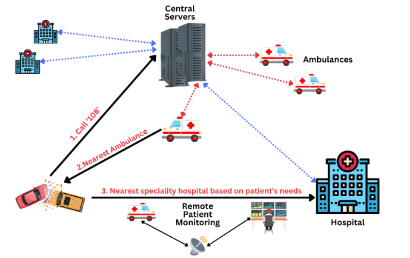
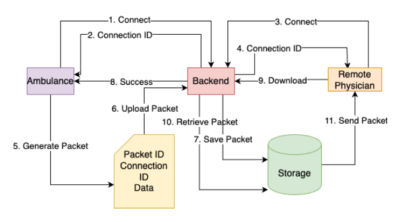
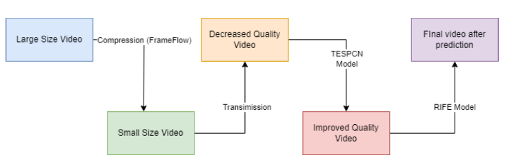

# PHMS: Pre-Hospital Management System with Real-Time Patient Monitoring

*Picture: PHMS: proposed Pre-Hospital Management System(PHMS) Ecosystem*

## Content

## Introduction
This repository contains the code release of following paper

> **Title** :  PHMS: Pre-Hospital Management System with
Real-Time Patient Monitoring

> **Abstract** : Connected ambulances and hospitals with real-time
patient monitoring can provide timely diagnoses and treatment to
patients in emergencies. While paramedics in ambulances provide
initial treatment, there are cases where their capabilities fall
short of addressing severe conditions. We propose a method that
allows remote monitoring of patients in ambulances by physicians
located at the hospital, using real-time video transfer for visual
observation and informed assessments. It prioritizes robustness
and adaptability to overcome network coverage limitations,
ensuring continuity of care for improved outcomes and patient
well-being. The proposed method utilizes frame prediction, com-
pression, and network transmission techniques. It aims to deliver
efficient, uninterrupted video while reducing data size, latency,
and bandwidth requirements. A hybrid compression technique
that combines spatial and temporal methods to compress video
frames effectively, which are then transmitted over the network
using a packet-based transmission approach.
Index Terms—Machine Learning, Frame Prediction, Frame
compression, Packet Transfer, Remote Monitoring 

## Methodology
Our Methodology consist of three major steps:
* Video Compression Module
    - The video compression module compresses the video
frames using the FFmpeg library to reduce their size and make
transferring them over the network easier. Command-line tool
FFmpeg manipulates multimedia files using C and multiple
audio and video processing libraries.

* Network Transfer Module
    - The Network Transfer Module deals with the transmission
of data from ambulances in transit to the hospital for efficient
remote monitoring

*Picture: Network Architecture to enable remote patient monitoring in the proposed PHMS*

* Prediction Module
    - The prediction module is responsible for
predicting the frames of the ambulance video at the base
hospital. This module comprises of two subparts: the first
subpart involves enhancing the resolution of the video, while
the second subpart involves predicting frames using the
improved resolution video.

*Picture: Prediction of compressed videos by RIFE and the proposed TESPCN model.*

## Dataset

The complete video file of ambulance condition can be requested through this [form](https://forms.gle/vosE7cfRPwZR8VmS8).

